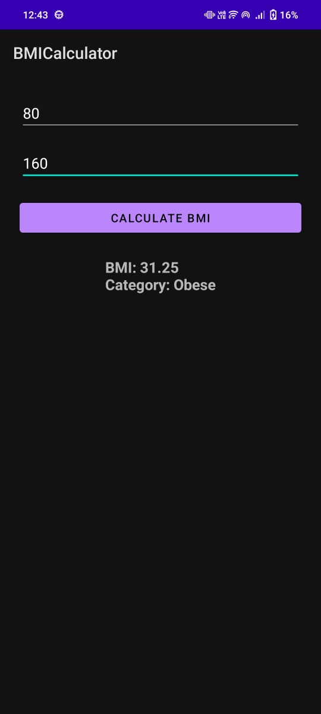

🧮 BMI Calculator Android App

A simple and elegant **BMI (Body Mass Index) Calculator** Android app built using **Java + Android Studio**. Calculates BMI from weight and height inputs and shows the result with category.

📱 Features

- 💪 BMI Calculation based on user input
- ⚡ Instant result with health category (Underweight, Normal, Overweight, Obese)
📸 

🛠️ Tech Stack

- Language: Java
- UI: XML (ConstraintLayout)
- IDE: Android Studio
